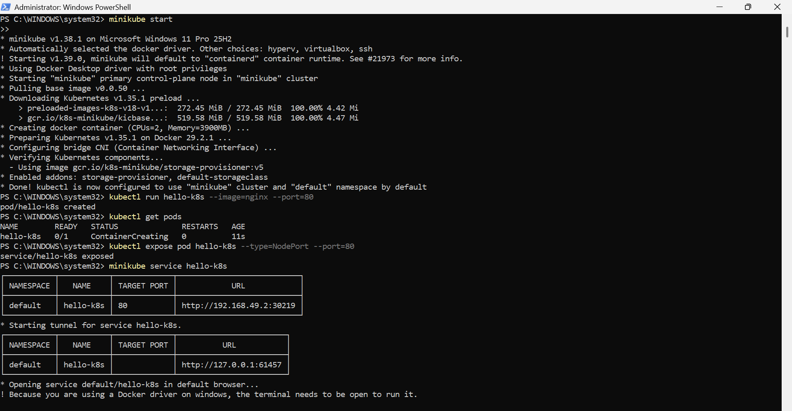

To run my first app inside Kubernetes and access it:
1. Docker Desktop was Installed
2. Minikube was installed

Steps involved:
1. Start a local Kubernetes cluster with Minikube:
minikube start
2. Create your first Pod (using Nginx image):
kubectl run hello-k8s --image=nginx --port=80
3. Verify the Pod is running:
kubectl get pods
4. Expose the Pod as a Service:
kubectl expose pod hello-k8s --type=NodePort --port=80
5. Open the app in your browser:
minikube service hello-k8s

